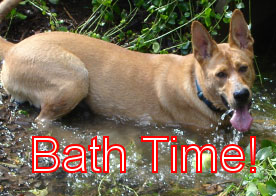

# Release Notes 0.7

**Released March 2nd, 2011**

Pinta 0.7 is a continuation of our "polish" phase. This release is primarily bug fixes. This version is considered "Beta 1". Based on bugs reported, the next release will either be Beta 2 (0.8) or 1.0.

## New Improvements

**Outlined Text Support** - *Jonathan Pobst*

Pinta now supports outlined text, for all your trollcats (and dogs) needs!

## Fixed Bugs

* [702272](https://launchpad.net/bugs/702272) - After closing multiple pasted images Pinta crashes
* [704265](https://launchpad.net/bugs/704265) - Using File | Save As for the SECOND time produces exception.
* [671495](https://launchpad.net/bugs/671495) - When clicked on canvas text is copied from doc1 to doc2 - why?
* [672232](https://launchpad.net/bugs/672232) - Pencil tool precision on zoomed canvas
* [692122](https://launchpad.net/bugs/692122) - The drawing created by paintbrush not on the clicked point
* [702547](https://launchpad.net/bugs/702547) - Paintbrush size 1 doesn't work
* [702925](https://launchpad.net/bugs/702925) - There is no difference using cut and copy
* [703111](https://launchpad.net/bugs/703111) - Crop to Selection only crops to a rectangle
* [707587](https://launchpad.net/bugs/707587) - Transparency does not work
* [701732](https://launchpad.net/bugs/701732) - Paintbrush doesn't show the full circle initially
* [702047](https://launchpad.net/bugs/702047) - Non-English strings in Non-English Pinta
* [702156](https://launchpad.net/bugs/702156) - A bit of the text cursor remains when using large fonts
* [721678](https://launchpad.net/bugs/721678) - New image window does not except Enter as default action for OK button

[Bug Tracker][1]

## Community

### Contributors For This Release
The following people directly contributed to this version of Pinta. Without their help, this version of Pinta would look suspiciously like the last version!

*Jonathan Pobst*

If I missed your name, it was not intentional! Please let me know and I'll add it!

And of course thanks to everyone who contributed translations, filed bugs, made packages, and everything else that has made Pinta what it is today!

### Contributors To Past Releases

*Aaron Bockover, Anirudh Sanjeev, Greg Lowe, Hanh Pham, Joe Hillenbrand, Jon Rimmer, Jonathan Pobst, Juergen Obernolte, Khairuddin Ni'am, Krzysztof Marecki, Maia Kozheva, Marco Rolappe, Mathias Fusseneggerg, Obinou Conseil, Olivier Dufour, Richard Cohn*

[1]: https://bugs.launchpad.net/pinta/+bugs
